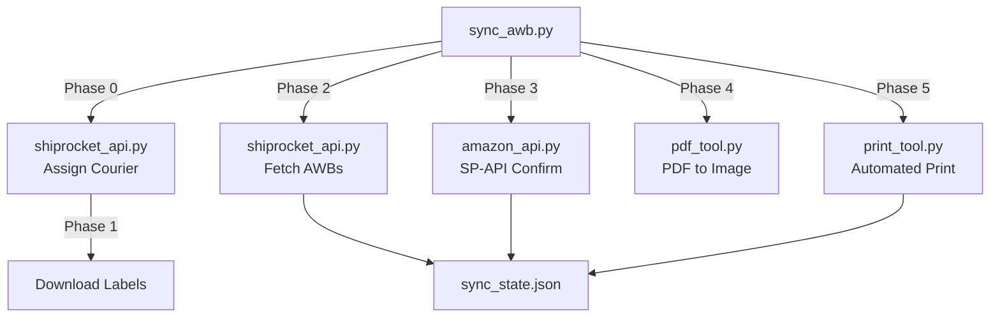

# ShipSense: Multi-Channel AWB Sync Agent (100% API)

Fully automated synchronization that reads AWB tracking numbers from the Shiprocket REST API and submits them to Amazon via the Selling Partner API (SP-API).

**Zero Browser Dependency** — this version works entirely in the background using official APIs, making it faster and 100% reliable.

## Architecture



| File | Purpose |
|---|---|
| `sync_awb.py` | Main orchestrator – runs Phase 0 to Phase 5 |
| `sync_dashboard.py` | Aggregates sales, cancellation fees, and net profits with COGS recovery from Amazon (LIRIYA) & LIRIYA (WooCommerce), then caches them to disk |
| `logger.py` | Centralized logging factory with stdout and 10MB rotating file handlers |
| `shiprocket_api.py` | API client for courier assignment, AWB fetching, and label downloads |
| `amazon_api.py` | SP-API client for orders list, item details, financial event fees, and shipment confirmation |
| `pdf_tool.py` | Utility to convert A6 PDFs to high-quality images |
| `print_tool.py` | Utility to send images to the printer with **Auto IP Discovery** |
| `state_manager.py` | JSON state library tracking sync and print status |
| `sync_state.json` | Local database for idempotency in sync_awb |
| `order_db.py` | SQLite DB logic (`orders_data.db`) caching Amazon & WooCommerce orders to reduce API calls |
| `freight_db.py` | SQLite DB logic (`freight_data.db`) tracking Shiprocket freight costs persistently |
| `product_costs.csv` | Local cost file mapping Seller SKUs to COGS |
| `freight/` | Local folder storing the SQLite databases and old monthly Shiprocket invoice CSVs |

---

## Setup

```bash
cd /Users/kamal/Desktop/shiprocketAgent

# Create virtual environment
python3 -m venv venv
source venv/bin/activate

# Install Python dependencies
pip install -r requirements.txt
```

### Configuration (.env)
| Key | Required? | Purpose |
|---|---|---|
| `SHIPROCKET_EMAIL` | Yes | Login for Shiprocket API |
| `SHIPROCKET_PASSWORD` | Yes | Password for Shiprocket API |
| `AMAZON_CLIENT_ID` | Yes | Amazon SP-API Client ID |
| `AMAZON_CLIENT_SECRET` | Yes | Amazon SP-API Client Secret |
| `AMAZON_REFRESH_TOKEN` | Yes | Amazon SP-API Refresh Token |
| `AMAZON_MARKETPLACE_ID`| Yes | India: `A21TJRUUN4KGV` |
| `DRY_RUN` | No | Set to `true` to skip actual changes |

---

## Runbook

### 0. The Web UI Dashboard (New!)
We have introduced a beautiful, glassmorphic FastAPI dashboard containing two main sections:
- **Fulfillment Operations (`/shipments`)**: Allows running automated syncs, custom WooCommerce syncs, and manual prints right from the GUI. Displays real-time pending orders from Amazon and WooCommerce.
- **Business Revenue Dashboard (`/revenue`)**: Integrates and charts revenue, exact Amazon fees, payment gateway commissions, freight costs from Shiprocket invoices, and exact net margins (including COGS recovery for full refunds and cancellation fee tracking).
- **Run Sync on Demand**: Trigger dashboard calculations dynamically from the browser via Server-Sent Events.

```bash
# Start the server (runs on port 8000)
cd server
uvicorn app:app --port 8000
# Then visit http://127.0.0.1:8000/shipments or http://127.0.0.1:8000/revenue
```

### 1. The Amazon Automated Workflow
```bash
python sync_awb.py --amazon
```
**What happens in one run (100% background):**
1. **Phase 0**: Assigns preferred couriers (Delhivery/BlueDart) to "NEW" Amazon orders.
2. **Phase 1**: Downloads and renames labels to `{amazon_order_id}.pdf`.
3. **Phase 2**: Fetches AWB numbers and updates local state.
4. **Phase 3**: Submits tracking info to Amazon via **SP-API**.
5. **Phase 4**: Converts labels to `.png` images.
6. **Phase 5**: Automatically prints new images at **A6 size**.

### 2. The Custom Channel Workflow
```bash
python sync_awb.py --liriya
```
**What happens in Liriya mode:**
Processes non-Amazon orders specifically from the `LIRIYA (WOOCOMMERCE)` channel. It assigns couriers, downloads labels, and prints them, while entirely bypassing the Amazon SP-API synchronization. To prevent duplicate prints, it injects dummy `LIRIYA_{id}` state entries into the `sync_state.json` file.

### 3. Manual PDF Processing
- **Batch Folder**: `python pdf_tool.py batch [folder_path]`
- **Single Image**: `python pdf_tool.py image [input.pdf] [output.png] 5 5 425 590`

### 4. Smart Printing features
- **Auto IP Discovery**: If your printer's IP changes, the script will automatically find it using its MAC address and update the settings.
- **Auto-Archiving**: Once a label is successfully printed, both the PDF and PNG files are automatically moved to a `printed/` subfolder to prevent accidental duplicate prints in the future.
- **Print State Tracking**: Only prints labels that aren't already marked as `label_printed` in `sync_state.json`.

### 5. Status and Checks
- `python sync_awb.py --check-new`: Compare LIVE unshipped orders on **Amazon** vs pending orders on **Shiprocket**.
- `python sync_awb.py --status`: Print current sync summary from local state.
- `python sync_awb.py --dry-run`: Preview changes without execution.
- `python sync_awb.py --print-order <ID>`: Force download and print a label for a specific Amazon Order ID, Shiprocket Order ID, or AWB. Skips syncing.
- `python sync_awb.py --amazon --orders <ID1>,<ID2>`: Selectively process specific Amazon orders in a batch instead of all pending orders.
- `python sync_awb.py --liriya --orders <ID1>,<ID2>`: Selectively process specific WooCommerce orders.

---

## Testing

The project includes a comprehensive headless test suite using `pytest` and `pytest-mock`. All tests are decoupled from external APIs (Shiprocket and Amazon SP-API).

```bash
# Run all unit tests with verbose output
python -m pytest tests/ -v
```

The `tests/` directory includes coverage for:
- `test_amazon_api.py`: Validates SP-API payload formatting, LWA token logic, order pagination (`NextToken`), rate limit retries (429 backoff), and finances event adjustments.
- `test_shiprocket_api.py`: Validates regex parsing, API endpoints, and dummy state generation.
- `test_state_manager.py`: Ensures `sync_state.json` updates identically to production logic.
- `test_sync_awb.py`: Mocks command line flags (like `--amazon` and `--liriya`) and validates execution pathways.
- `test_sync_dashboard.py`: Validates CSV loading for cost price and freight matrix parsing, WooCommerce pagination, payment gateway fee calculation, and multi-layered shipping cost matching.
- `test_app.py`: Validates web server endpoints, SSE logging stream configurations, and unified pending order API sorting.
- `test_logger.py`: Verifies logs directory auto-creation, format validation, and handler duplication guard logic.

---

## Troubleshooting

### "Looking for printer" status
The script automatically attempts to resolve this. If it persists:
1. Ensure the printer is on the same network.
2. The printer's MAC address is hardcoded in `print_tool.py`.

### "InvalidCarrier" Error
1. The script maps common carriers (Delhivery, BlueDart, etc.).
2. Blue Dart orders should use `BlueDart` (no space) in the Amazon payload.
